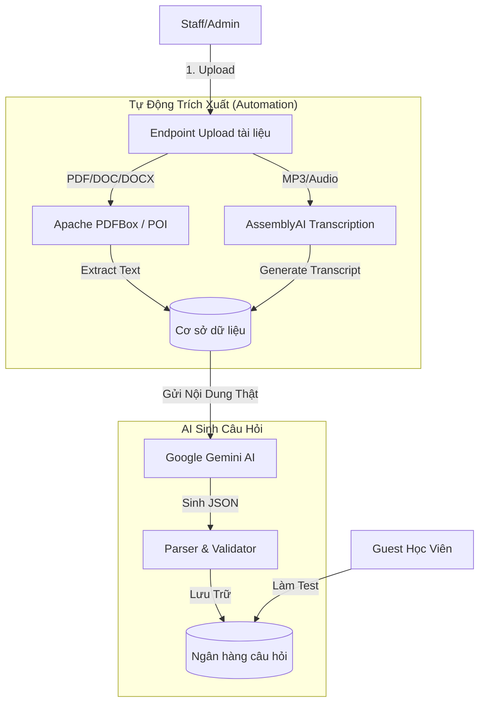
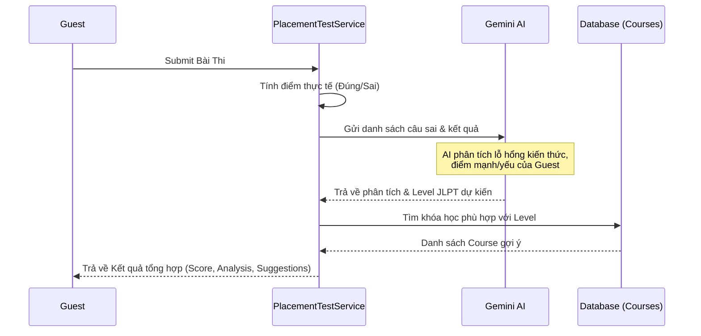

# Hướng Dẫn Luồng Hoạt Động: Quản Lý Tài Liệu & AI Sinh Câu Hỏi

Tài liệu này tóm tắt quy trình tự động hóa mới: Staff upload tài liệu và hệ thống (AI) tự động đọc nội dung để sinh câu hỏi trắc nghiệm (bao gồm cả Listening và Reading).

---

## 🏗 Tổng Quan Quy Trình

Hệ thống đã được nâng cấp để **tự động đọc nội dung file**. Staff không còn cần phải mô tả nội dung thủ công.

---

## 🛠 1. Giai Đoạn Upload (Staff)

Staff sử dụng các endpoint sau để đưa tài liệu vào hệ thống:

*   **Tài liệu đọc (Reading):** `POST /api/placement-documents/reading`
    *   Hỗ trợ: PDF, DOC, DOCX.
    *   **Tự động:** Ngay khi upload, hệ thống dùng `PDFBox` hoặc `POI` để đọc toàn bộ chữ trong file và lưu vào database.
*   **Tài liệu nghe (Listening):** `POST /api/placement-documents/listening`
    *   Hỗ trợ: MP3, WAV, M4A, OGG.
    *   **Tự động:** File được lưu lên Cloudinary để phục vụ việc nghe của học viên.

---

## 🤖 2. Giai Đoạn AI Sinh Câu Hỏi

Sau khi có tài liệu, Staff kích hoạt AI bằng các lệnh:

### A. Sinh câu hỏi từ văn bản (Reading)
*   **Lệnh:** `POST /api/placement-documents/{id}/generate-reading`
*   **Cơ chế:** AI đọc nội dung text đã được trích xuất từ file PDF/DOC trước đó. Nó sẽ đặt các câu hỏi về ngữ pháp, từ vựng hoặc đọc hiểu dựa trên chính những gì có trong file.

### B. Sinh câu hỏi nghe (Listening)
*   **Lệnh:** `POST /api/placement-documents/{id}/generate-listening`
*   **Cơ chế:**
    1.  Hệ thống gửi file audio sang **AssemblyAI** để chuyển âm thanh thành văn bản tiếng Nhật.
    2.  Văn bản này được gửi cho **Gemini AI** để tạo câu hỏi nghe hiểu.
    3.  Mỗi câu hỏi sẽ tự động được gắn link audio để học viên nghe khi làm bài.

### C. Trộn tài liệu (Mixed-Mode)
*   **Lệnh:** `POST /api/placement-documents/generate-mixed`
*   **Cơ chế:** AI lấy ngẫu nhiên 5 tài liệu Reading khác nhau, trộn nội dung lại để tạo ra bộ câu hỏi tổng hợp đa dạng nhất.

---

## 📝 3. Luồng Làm Bài Test Của Guest

Quy trình Guest thực hiện bài kiểm tra trình độ:

1.  **Lấy đề thi:** `GET /api/placement-test/questions?count=25`
    *   Hệ thống tự động mix câu Reading và Listening theo tỷ lệ (ví dụ: 25 câu có 3 câu nghe).
    *   Mỗi câu hỏi sẽ bao gồm: Nội dung, 4 đáp án, và `audioUrl` (nếu là câu nghe).
2.  **Làm bài:** Guest thực hiện bài thi trên giao diện. Các câu nghe sẽ có trình phát nhạc hỗ trợ.
3.  **Nộp bài:** `POST /api/placement-test/submit`
    *   Guest gửi danh sách ID câu hỏi và đáp án đã chọn.

---

## 🧠 4. AI Chấm Điểm & Gợi Ý Khóa Học

Sau khi Guest nộp bài, hệ thống thực hiện luồng xử lý thông minh:

### Kết quả Guest nhận được bao gồm:
*   **Tổng số câu đúng/sai.**
*   **Phân tích chi tiết từ AI:**
    *   Đánh giá kỹ năng: Từ vựng, Ngữ pháp, Nghe hiểu.
    *   Lưu ý những lỗi hay mắc phải.
*   **JLPT Level dự kiến:** (Ví dụ: N4).
*   **Danh sách khóa học gợi ý:** Hiển thị dưới dạng thẻ (Cards) bao gồm: thumbnail, giá, mô tả ngắn để Guest có thể đăng ký học ngay.

---

## 💡 Lưu Ý Quan Trọng

1.  **Tính chính xác:** AI chấm điểm dựa trên dữ liệu thực tế Guest đã làm, giúp đưa ra lộ trình học tập cá nhân hóa.
2.  **Khóa học:** Các khóa học được gợi ý dựa theo Level mà AI đánh giá (Ví dụ: Evaluation là N3 sẽ gợi ý các khóa luyện thi N3 hoặc các module kiến thức N3).
3.  **Tự động:** Toàn bộ quá trình từ upload tài liệu của Staff đến khi Guest nhận được lộ trình học đều được liên kết chặt chẽ và tự động hóa cao.
